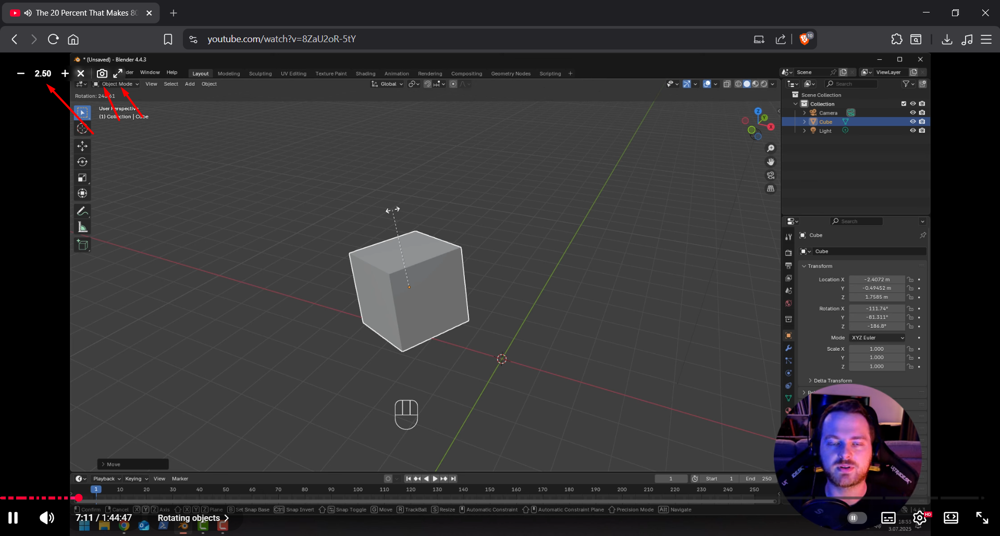

# YT Lite Enhancer

YT Lite Enhancer is a lightweight, performance-focused Chrome extension designed to improve your YouTube viewing experience. It provides seamless video speed control and a distraction-free "Windowed Mode" without bloating your browser.

## What can it do?

### 1. Focus Mode (Windowed View) 🖥️
One click (or press **`W`**) and everything distractions disappear. No comments, no sidebar recommendations, no "Up Next". Just you and the video. Perfect for studying or watching tutorials.

### 2. Smart Speed Control 🚀
You can speed up or slow down videos with hotkeys or the overlay buttons. But here's the cool part:
- **It remembers your speed:** If you're binge-watching a playlist at 2x speed, the next video will automatically start at 2x.
- **It's smart:** If you switch to a different playlist or a random video, it resets to normal so you don't accidentally watch a music video in chipmunk mode.
- **Session-based:** It keeps your speed preference in memory only while you're watching. Close the tab, and it's gone. No clutter left behind.

### 3. Quick Screenshots 📸
Ever wanted to save a frame from a video? There's a camera button now. Click it, and it instantly saves the frame as a high-quality PNG. No more Print Screen + Cropping in Paint.

### 4. Zero Performance Impact ⚡
I hate extensions that eat up RAM.
- **Lazy Loading:** The control panel doesn't even exist until you hover over a video. If you're on a page with no video, this extension uses **0% resources**.
- ** optimized:** It uses `sessionStorage` and singleton patterns to make sure it's as light as a feather.

## Shortcuts

Default keys (you can change these in options):

| Key | Action |
| :--- | :--- |
| **`D`** | Faster (+0.10x) |
| **`S`** | Slower (-0.10x) |
| **`R`** | Reset to 1.0x |
| **`W`** | Toggle Windowed Mode |

## How to Install

Since this is a developer version:
1.  Download/Clone this folder.
2.  Go to `chrome://extensions/` in Chrome/Edge/Brave.
3.  Turn on **Developer mode** (top right).
4.  Drag and drop this folder in.